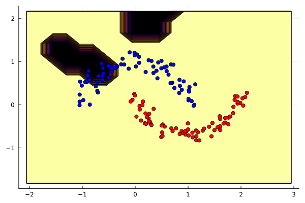

# MicroGrad.jl

A Julia port of Andrej Karpathy's [micrograd](https://github.com/karpathy/micrograd/tree/master).

This repo was born from an excise of working through Karpathy's excellent [tutorial](https://www.youtube.com/watch?v=VMj-3S1tku0) in order to learn something about backpropagation and Julia.

## Notes

- MicroGrad itself has no third party dependencies.
- Code organization is the same as the original repo:
    - `src/engine.jl`: the engine
    - `src/nn.jl`: Neuron, Layer and MLP
    - `test/engine_tests.jl`: a port of the original `test/test_engine.py` using [Zygote](https://github.com/FluxML/Zygote.jl) instead of PyTorch as reference.

## Run test

```shell
julia> ] # ] to enter Pkg mode
pkg> activate .
(MicroGrad)pkg> test
```

## Run demo notebook

`demo.jl` is roughly a combined port of the `trace_graph.ipynb` and `demo.ipynb` Jupytor notebooks from the original repo to showcase solving a simple classification problem using MicroGrad.

To run the notebook:

```shell
julia> ]
pkg> add Pluto # backspace to exit Pkg mode
julia> using Pluto; Pluto.run()
```

Pluto should open in browser automatically, then select `demo.jl` using the web interface.


